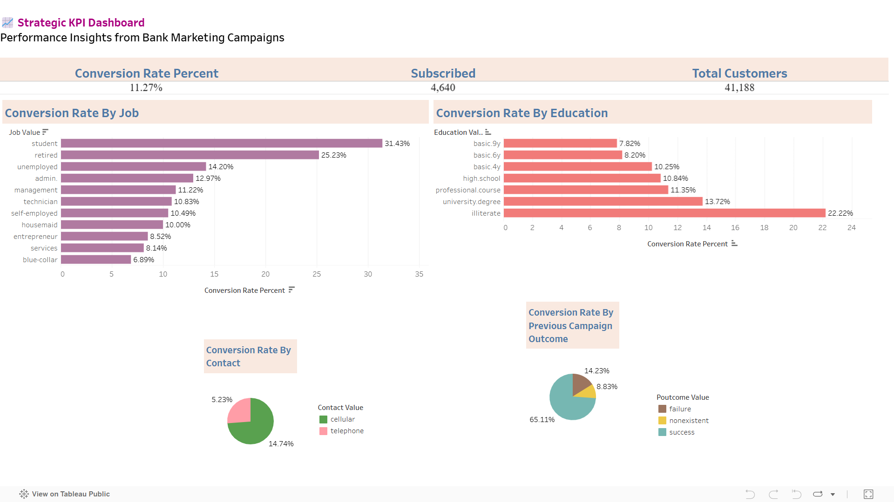

# 📊 Bank Marketing Campaign Analytics: SQL, Python & Tableau KPI Dashboard

Analyze 41K+ banking customer interactions using **SQL**, **Python**, **PostgreSQL**, and **Tableau**. Identify financial behavior patterns, customer segments, and marketing insights, and generate SQL-driven KPIs with interactive Tableau dashboards to support data-driven decision-making.

---

## 🧠 Project Summary

This project explores a real-world dataset from a Portuguese banking institution that ran a series of direct marketing campaigns via phone calls. The goal is to analyze the financial and customer behavior data to uncover insights into successful term deposit subscriptions and develop strategies for more effective future campaigns.

---

## 📁 Dataset: Bank Marketing (Kaggle)

- **Records**: 41,188 rows  
- **Attributes**: 20 features (excluding duration to prevent data leakage)  
- **Source**: [Kaggle Dataset](https://www.kaggle.com/datasets/ruthgn/bank-marketing-data-set)  
- **Originally analyzed by**: [Moro et al., 2014]

### Dataset Contents:
- **Client info**: Age, job, marital status, education, default credit
- **Loan info**: Housing and personal loan flags
- **Campaign info**: Contact type, campaign outcome, call frequency
- **Contextual info**: Economic indicators (emp.var.rate, euribor3m, etc.)
- **Target variable**: `y` – whether the client subscribed to a term deposit

---

## 🎯 Project Objectives

- Clean and preprocess campaign data using Python  
- Build normalized PostgreSQL database schema (fact and dimension tables)  
- Load transformed data into PostgreSQL  
- Write Python scripts to automate table creation, normalization, and loading  
- Derive actionable KPIs through SQL  
- Export KPI results into CSV  
- Build an interactive Tableau dashboard for reporting and insights  

---

## 🛠️ Tools & Technologies

- **Python**: pandas, NumPy, SQLAlchemy, psycopg2, matplotlib  
- **SQL**: PostgreSQL, schema design, joins, aggregates  
- **Tableau**: Visualization and KPI dashboard  
- **VS Code** for development  
- **GitHub** for version control  

---

## 📁 Folder Structure

```

financial-metrics-analysis/
│
├── data/                          # All datasets
│   ├── raw/                       # Original input CSV (from Kaggle)
│   ├── processed/                 # Cleaned data used for SQL/analysis
│   └── export/                    # Exported KPI results used in Tableau
│
├── scripts/                       # Python scripts for data cleaning and automation
│   ├── data_cleaning.py
│   ├── generate_create_table_sql.py
│   ├── generate_dimension_tables.py
│   ├── generate_fact_table_sql.py
│   └── export_kpis_to_csv.py
│
├── sql/                           # SQL scripts for table creation and loading
│   ├── create_tables/             # CREATE TABLE scripts (raw, fact, dimensions)
│   ├── kpi/                       # SQL scripts to generate KPI outputs
│   └── load_data/                 # Scripts to populate tables using COPY
│
├── dashboard/                     # Tableau dashboards and exports
│   └── Dashboard1.png           # Final dashboard snapshot/report
│
├── requirements.txt              # Project dependencies
└── README.md                     # Project documentation
```

---

## 🧰 Project Workflow

### 1️⃣ Project Setup
- Created GitHub repository and cloned to VS Code  
- Created folder structure: `data/raw`, `data/processed`, `sql/create_tables`, `scripts`, etc.  
- Initialized `requirements.txt` with necessary libraries  

### 2️⃣ Data Preprocessing
- Loaded raw CSV file into `data/raw/`  
- Cleaned the dataset using Python:  
  - Renamed and standardized column names  
  - Removed nulls and trimmed whitespaces  
  - Exported cleaned data to `data/processed/`  

### 3️⃣ PostgreSQL Table Creation
- Generated SQL scripts using Python to create:  
  - `bank_marketing` raw table  
  - Normalized dimension tables (`dim_job`, `dim_education`, etc.)  
  - `bank_marketing_fact` fact table  
- Handled PostgreSQL reserved keywords like `default`  

### 4️⃣ Data Normalization
- Wrote a Python script to extract unique values for categorical columns  
- Created corresponding dimension tables  
- Populated dimension and fact tables using SQL and Python  

### 5️⃣ Data Loading
- Loaded all data into PostgreSQL using SQL `COPY` and Python  
- Verified row counts and relationships  

### 6️⃣ KPI Development
- Created 5 KPI SQL queries based on business use cases  
- Saved each as individual `.sql` files in `sql/kpis/`  

### 7️⃣ KPI Export Automation
- Wrote a Python script to:  
  - Read all `.sql` KPI files  
  - Execute them on PostgreSQL  
  - Export results to `.csv` in `data/export/`  

### 8️⃣ Tableau Dashboard Creation
- Connected Tableau to KPI export `.csv` files  
- Designed 5 visual KPI sheets:  
  - Big Number Tile for Conversion Summary  
  - Bar Charts for Job & Education  
  - Pie Charts for Contact Method & Poutcome  
- Assembled into one executive dashboard layout  
- Added subtitle and source credits to bottom-left corner  

---

## 📊 KPIs & Business Insights

This project analyzes a bank's direct marketing campaign data to generate actionable KPIs that help optimize strategy, improve targeting, and increase conversion rates.

---

### 📈 KPI 1: Overall Conversion Rate  
- **Business Problem**: How effective is our marketing campaign overall?  
- **Business Insight**: If the conversion rate is low, the campaign strategy, audience targeting, or messaging may need to be revised.

---

### 👥 KPI 2: Conversion Rate by Job  
- **Business Problem**: Which customer job segments are most responsive?  
- **Business Insight**: Focus future campaigns on job roles with higher conversion rates to improve ROI and outreach efficiency.

---

### 🎓 KPI 3: Conversion Rate by Education Level  
- **Business Problem**: How does educational background affect campaign success?  
- **Business Insight**: Tailor campaign messaging or product offerings based on the education level of the target audience.

---

### ☎️ KPI 4: Conversion Rate by Contact Method  
- **Business Problem**: Which contact method (e.g., cellular, telephone) is most effective?  
- **Business Insight**: Optimize marketing costs and effectiveness by prioritizing the communication channels with higher conversion rates.

---

### 🔁 KPI 5: Conversion Rate by Previous Campaign Outcome  
- **Business Problem**: Does a customer’s past campaign outcome influence current conversion likelihood?  
- **Business Insight**: Prioritize follow-ups with customers who had a positive or no previous interaction, and consider excluding those with prior negative outcomes.

---

## 📌 Dashboard Snapshot

_Interactive Tableau dashboard showcasing all five KPIs for decision-making._



---

## 📎 Attribution

- **Dataset**: [Kaggle - Bank Marketing Dataset](https://www.kaggle.com/datasets/ruthgn/bank-marketing-data-set)  
- **Original Source**: [Moro et al., 2014], University of Minho, Portugal  
- **Tech Stack**: Python, SQL (PostgreSQL), Tableau, Git

---

## 📬 Contact

**Author**: Alekhya Ramisetti  
📧 **Email**: ar89z@umsystem.edu  
🔗 **LinkedIn**: [linkedin.com/in/alekhyaramisetti](https://www.linkedin.com/in/alekhyaramisetti/)
